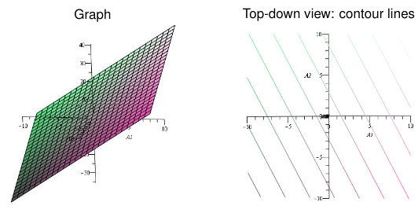
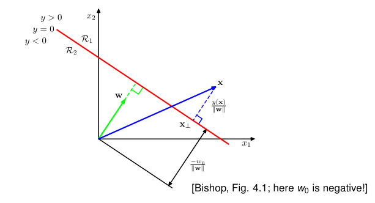
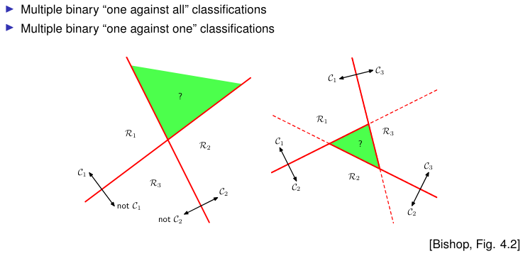

# Prediction

#### K Nearest Neighbor Classifier

- non linear
- **Principle**: near neighbors tend to have the same label.
- **Required**: distance function $d(x, x')$ to measure distances between attribute vectors (e.g. Euclidean distance if all attributes are real numbers, i.e., $x ∈ R^D$ ).

#### The perceptron

- Input layer
- No hidden layers
- One output neuron
- Sign activation function at output neuron
- The orginal return only 1 or -1

Shown are decision regions

$$
\{(x_1, x_2) | w · x > 0\}
$$

and

$$
\{(x_1, x_2) | w · x ≤ 0\},
$$

and the predicted class labels for instances in these regions.

> The decision regions defined by a perceptron are always separated by a **linear hyperplane.**

this linear hyperplane is not able to classify XOR.

#### Naive Bayes Model

[sad theory]

Perceptron and Naive Bayes are limited

Can not learn to classify XOR function

#### Overfitting

Given a hypothesis space $H$, a hypothesis $h ∈ H$ is said to overfit
the training data if there exists some alternative hypothesis $h' ∈ H$,
such that $h$ has smaller error than $h'$ over the training examples, but
$h'$ has a smaller error than $h$ over the entire distribution of instances
[Mitchell, p. 67].

- the hypothesis space (or model space) can be structured by some model parameter
  - Nearest Neighbor classifier: k value
  - Neural Network: Number of hidden units/layers
  - Bayesian Network: Complexity of BN structure
- different parameter values lead to more or less complex decision regions
  - NN classifier: small k ⇝ complex decision regions
- a hypothesis h overfits, if its decision regions are too closely fitted to the training data.

### Linear Models

Benefits

- Unlikely to overfit
  - But still possible: even for linear models we use techniques to prevent overfitting
- Easy to learn from data
- Well understood
- Central building block also for more complex non-linear models

Diversity
Different types of linear classification models

- have the same capacity: they can represent exactly the same classification rules,
  but they
- are based on different objective functions that are optimized in learning
- Perceptron: minimize an error function
- Naive Bayes: maximize likelihood function
- provide different learning methods/algorithms,
- return different results!

## Linear Models for Classification

Linear function of numeric attributes $X_1, . . . , X_D$ with coefficients $w_0, w_1, . . . , w_D ∈ R$:

$$
y(x_1, . . . , x_D ) = w_0 + w_1x_1 + . . . + w_D x_D
$$

Plots for D = 2, w_0 = 2.5, w_1 = 1.3, w_2 = 1.3:

## 4.1.1 **Linear Discriminant Function (Two‑Class Case)**

A discriminant is a function that takes an input vector $x$ and assigns it to one of $K$ classes, denoted $C_k$. In this chapter, we shall restrict attention to linear discriminants, namely those for which the decision surfaces are hyperplanes. To simplify the discussion, we consider first the case of two classes and then investigate the extension to $K > 2$ classes.

#### **Linear discriminant**

$$
y(x) = w^T x + w_0
$$

Where $w$ is called a weight vector, and $w_0$ is a bias.
The negative of the bias is sometimes called a threshold. An
input vector $x$ is assigned to class $C_1$ if $y(x) > 0$ and to class $C_2$ otherwise.

#### **Decision boundary**

$$
y(x) = 0
$$

The corresponding decision boundary is therefore defined by the relation $y(x) = 0$, which corresponds to a $(D − 1)$-dimensional hyperplane within the $D$-dimensional input space.

#### **Normal distance to decision boundary**

Consider two points $x_A$ and $x_B$ both of which lie on the decision surface.
Because $y(x_A) = y(x_B) = 0$, we have $w^T(x_A − x_B) = 0$ and hence the vector $w$ is orthogonal to every vector lying within the decision surface, and so $w$ determines the orientation of the decision surface. Similarly, if $x$ is a point on the decision surface, then $y(x) = 0$, and so the normal distance from the origin to the decision surface is given by

$$
\frac{w^T x}{\lVert w \rVert} = - \frac{w_0}{\lVert w \rVert}
$$

##### Proof of the orthogonal property of $w$ on the decision surface

Let $x_A$ and $x_B$ be any two points on the decision boundary:

$$
y(x_{A,B}) = w^T x_{A,B} + w_0 = w_0
$$

this two equalities mean

$$
w^T x_{A} = - w_0 \\
w^T x_{B} = - w_0
$$

Subtract the equations

$$
w^T x_{B} - w^T x_{A} = 0
$$

Factor out $w^T$

$$w^T(x_A - x_B) = 0$$

This means that the vector $x_A - x_B$ is a deirection that lies entirely in the decision boundary, because the difference lies within the surface (it is a direction tangent to the surface).
The deriving dot product

$$w^T(x_A - x_B) = 0 \rightarrow w_\perp(x_A - x_B)$$

i.e., $w$ is perpendicular to every direction that lies within the surface.

A hyperplane is defined as all vectors satisfying:

$$
w^T x = \text{constant}
$$

In geometry:

- A vector perpendicular to every direction in a surface is the normal vector to that surface.
- The normal vector determines the orientation of the surface.

Thus:

> The decision boundary is a hyperplane whose orientation is defined by $w$

#### **Orthogonal decomposition of a point**

If $x_\perp$ is the projection of $x$ onto the decision surface:

$$
x = x_\perp + r \frac{w}{\lVert w \rVert}
$$

#### **Signed distance from decision boundary**

Multiplying both sides of this result by $w^T$ and adding $w_0$, and making use of $y(x) = w^T x + w_0$ and $y(x_\perp) = w^T x_\perp + w_0 = 0$, we have

$$
r = \frac{y(x)}{\lVert w \rVert}
$$

______________________________________________________________________

## **Augmented Vector Notation**

Define augmented vectors:

$$
\tilde{x} = (1, x), \qquad \tilde{w} = (w_0, w)
$$

Discriminant in compact form:

$$
y(x) = \tilde{w}^T \tilde{x}
$$

# 4.1.2 Problems with combining binary classifiers

Two naive strategies cause ambiguity:

1. One‑versus‑rest:\
   Build K−1 discriminants, each separating class $C_k$ from all other classes.\
   This produces regions where more than one discriminant says “yes”, or where all say “no”, causing ambiguous classification.

1. One‑versus‑one:\
   Build $K(K−1)/2$ pairwise discriminants and classify by majority vote.\
   This can also create regions where no class obtains a consistent majority, again producing ambiguity.

These are illustrated in Figure 4.2 of the text.

______________________________________________________________________

# Correct multiclass linear discriminant formulation

The text proposes using **K simultaneous linear discriminant functions**, one for each class.

## 1 Definition of the K-class discriminant functions

For each class $C_k$, define a linear function

$$
y_k(x) = w_k^{T} x + w_{k0} \tag{4.9}
$$

where

- $w_k$ is the weight vector for class $C_k$
- $w_{k0}$ is the bias term for class $C_k$

## 2 Decision rule

Assign input $x$ to class $C_k$ if its discriminant output is strictly larger than that of all other classes:

$$
y_k(x) > y_j(x) \quad \text{for all } j \neq k
$$

> Thus, each class has its own linear scoring function, and classification is based on taking the maximum.

______________________________________________________________________

# Decision boundary between two classes

The classification boundary between two classes $C_k$ and $C_j$ occurs where both discriminant functions give the same score:

$$
y_k(x) = y_j(x)
$$

Substitute the definitions:

$$
w_{k}^{T} x + w_{k0} = w_{j}^{T} x + w_{j0}
$$

Rearrange:

$$
(w_k - w_j)^{T} x + (w_{k0} - w_{j0}) = 0 \tag{4.10}
$$

This equation is crucial. It is a linear equation in $x$, which means the boundary between any two classes is a hyperplane.

### Why this is a (D−1)-dimensional hyperplane

A linear equation of the form

$$
a^{T} x + b = 0
$$

with $a \neq 0$ always defines a $(D−1)$-dimensional hyperplane in D-dimensional space.
Thus all boundaries $y_k(x)=y_j(x)$ are linear, just like in the two‑class case.

______________________________________________________________________

# Convexity and single connectedness of decision regions

The text proves that each class region $R_k$ is convex.

## Pick two points inside the region

Let

$$
x_A, x_B \in R_k
$$

That means:

$$
y_k(x_A) > y_j(x_A), \quad y_k(x_B) > y_j(x_B) \quad \text{for all } j \neq k
$$

## Consider any point on the line segment between them

Define

$$
\hat{x} = \lambda x_A + (1 - \lambda) x_B \quad \text{with } 0 \le \lambda \le 1 \tag{4.11}
$$

This describes the full straight line segment between points $x_A$ and $x_B$.

## Linearity of the discriminant guarantees midpoint dominance

Since each discriminant function is linear in $x$, we have:

$$
y_k(\hat{x}) = y_k(\lambda x_A + (1 - \lambda) x_B)
$$

Compute using linearity:

$$
y_k(\hat{x})
= \lambda y_k(x_A) + (1 - \lambda) y_k(x_B)
\tag{4.12}
$$

Similarly:

$$
y_j(\hat{x})
= \lambda y_j(x_A) + (1 - \lambda) y_j(x_B)
$$

## Compare the class outputs

Since for all $j \neq k$:

$$
y_k(x_A) > y_j(x_A)
$$

and

$$
y_k(x_B) > y_j(x_B)
$$

Multiply first inequality by $\lambda$ and the second by $2-\lambda$, then add:

$$
\lambda y_k(x_A) + (1 - \lambda) y_k(x_B)
>
\lambda y_j(x_A) + (1 - \lambda) y_j(x_B)
$$

Thus:

$$
y_k(\hat{x}) > y_j(\hat{x})
$$

Hence $\hat{x}$ is also in region $R_k$.

## Conclusion

Because every line segment between any two points in $R_k$ lies entirely within $R_k$, the region is:

- singly connected
- convex

This is a direct geometric consequence of linear discriminant functions.

______________________________________________________________________

# Relation to two‑class case

For two classes only, we may either:

1. use the general K‑class method with two functions\
   $y_1(x)$ and $y_2(x)$,

or

2. use the simpler single discriminant\
   $y(x) = w^T x + w_0$

from Section 4.1.1.

Both formulations are equivalent.

# 4.1.3 Least Squares for Classification

The goal is to extend the least‑squares method, previously used for regression, to the classification setting using 1‑of‑K coding.

______________________________________________________________________

# 1. Model definition

For K classes, each class $C_k$ has its own linear model:

$$
y_k(x) = w_k^{T} x + w_{k0} \tag{4.13}
$$

for $k = 1, \ldots, K$.

To express all K models simultaneously, define:

- the augmented input vector

  $$
  \tilde{x} = (1, x^{T})^{T}
  $$

- the augmented parameter vector for class $C_k$

  $$
  \tilde{w}_k = (w_{k0}, w_k^{T})^{T}
  $$

Stack all $\tilde{w}_k$ into a parameter matrix

$$
\tilde{W} = \begin{bmatrix}
\tilde{w}_1 & \tilde{w}_2 & \cdots & \tilde{w}_K
\end{bmatrix}
$$

Then the multiclass linear predictor is

$$
y(x) = \tilde{W}^{T} \tilde{x} \tag{4.14}
$$

The predicted class is the index $k$ for which $y_k(x)$ is largest.

______________________________________________________________________

# 2. Least squares objective

We have N training examples $\{x_n, t_n\}$.\
Using 1‑of‑K coding, each target vector is

$$
t_n = (t_{n1}, \ldots, t_{nK})^{T}
$$

where exactly one entry equals 1.

Define:

- the matrix $T$$ whose nth row is $t_n^\{T}\$
- the matrix $\tilde{X}$ whose nth row is $\tilde{x}_n^{T}$

The least squares error is written compactly as

$$
E_D(\tilde{W})
= \frac{1}{2} \operatorname{Tr}\!\left\{(\tilde{X}\tilde{W} - T)^{T}(\tilde{X}\tilde{W} - T)\right\}
\tag{4.15}
$$

This is the sum of squared differences between predictions and targets, summed over all inputs and all classes.

______________________________________________________________________

# 3. Minimizing the error

We differentiate $E_D$ with respect to $\tilde{W}$ and set the derivative to zero.\
The result (mirroring the regression derivation in Chapter 3) is:

$$
\tilde{X}^{T}(\tilde{X}\tilde{W} - T) = 0
$$

Solve for $\tilde{W}$:

$$
\tilde{X}^{T} \tilde{X}\, \tilde{W} = \tilde{X}^{T} T
$$

Assuming $\tilde{X}^{T} \tilde{X}$ is invertible:

$$
\tilde{W} = (\tilde{X}^{T} \tilde{X})^{-1} \tilde{X}^{T} T
\tag{4.16}
$$

Define the pseudo‑inverse

$$
\tilde{X}^{\dagger} = (\tilde{X}^{T}\tilde{X})^{-1} \tilde{X}^{T}
$$

Then:

$$
\tilde{W} = \tilde{X}^{\dagger} T
$$

This is the exact least‑squares solution.

______________________________________________________________________

# 4. Resulting discriminant function

Substitute $\tilde{W}$ into the prediction formula:

$$
y(x) = \tilde{W}^{T} \tilde{x}
$$

Since $\tilde{W} = \tilde{X}^{\dagger} T$, then

$$
y(x) = T^{T} (\tilde{X}^{\dagger})^{T} \tilde{x}
\tag{4.17}
$$

This expresses predictions directly in terms of the training targets and the pseudo‑inverse of the design matrix.

______________________________________________________________________

# 5. Constraints preserved by least squares

Suppose that every target vector $t_n$ satisfies the linear constraint

$$
a^{T} t_n + b = 0
\tag{4.18}
$$

for fixed $a \in \mathbb{R}^{K}$, $b \in \mathbb{R}$.

Because least squares finds the linear function that best matches all targets under squared loss, and this is a strictly linear model, any linear constraint satisfied by the targets will also be satisfied exactly by the predictions:

$$
a^{T} y(x) + b = 0 \tag{4.19}
$$

for all inputs \$$x$\$.

For 1‑of‑K coding, each target satisfies

$$
\sum_{k=1}^{K} t_{nk} = 1
$$

Thus, the model outputs satisfy

$$
\sum_{k=1}^{K} y_k(x) = 1
$$

for every input. However, nothing constrains the individual values $y_k(x)$ to lie within $(0,1)$, so they cannot be interpreted as probabilities.

______________________________________________________________________

# 6. Problems with least squares for classification

The text notes two serious issues:

1. Sensitivity to outliers\
   Squared error penalizes points with large prediction magnitude, even when the model is confidently correct.\
   Outliers can shift the decision boundary significantly.

1. Poor performance in multiclass linear classification\
   Even when the classes are linearly separable, least squares may produce highly distorted regions, as illustrated in Figure 4.5.\
   This happens because least squares corresponds to maximum likelihood under a Gaussian assumption, which is inappropriate for discrete target vectors.

______________________________________________________________________

# Conclusion

Least squares for classification:

- produces a closed‑form solution
- preserves any linear constraints satisfied by all targets
- but does not ensure valid probability outputs
- and is often unsuitable for classification due to poor robustness and incorrect probabilistic assumptions

Subsequent sections of the chapter introduce more appropriate methods such as Fisher’s discriminant, the perceptron algorithm, and logistic regression.

______________________________________________________________________
