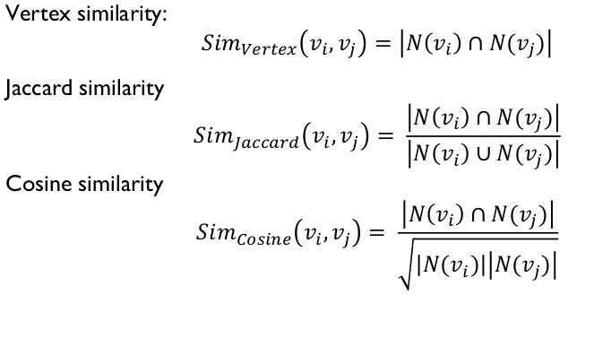
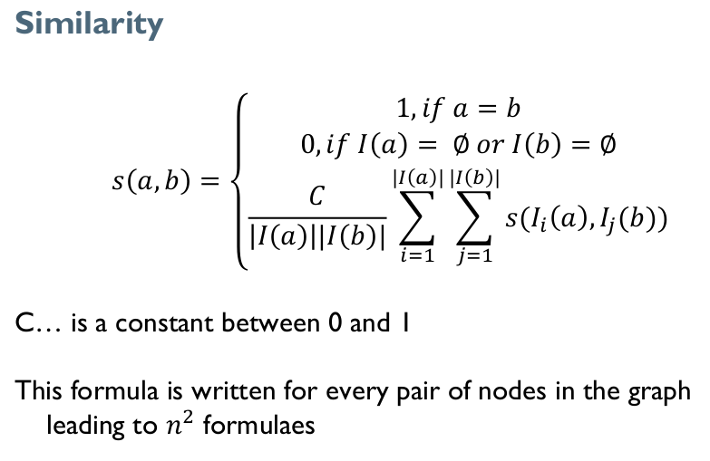
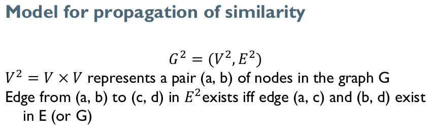

# Introduction and Link Prediction Based on Structural Similarity

## Introduction to social media analysis

## Basic graph theory
Definition 1.1 (Graph)

A graph is an ordered pair G = (V, E) where V is the set of vertices {v_1,...,v_n}, and E is a set of edges {e_1,...,e_n}.

Definition 1.2 (Graph Weighted)

A graph is an ordered pair G = (V, E, w) where V is the set of vertices {v_1,...,v_n}, E is a set of edges {e_1,...,e_n}, and W is a set of weights/labels/signs {w_1,...,w_n}.

Definition 1.3 (Degree of a node)

For directed graph
* In-degree of node v_i = number of edges pointing into the node. d_i^{in}
* Out-degree of node v_i = number of edges pointing away from the node. d_i^{out}
* Degree = In-degree + Out-degree. d_i

For undirected graph
* Undirected edge = two opposite directed edges (aka. bi-directional or
reciprocal edge)
* In-degree = Out-degree = number of edges connected to node
* Degree = **2 times the number of edges**

Definition 1.3.1 (Degree Distribution)

Degree distribution:

p_d=\frac{n_d}{n}

n_d :number of nodes with degree d 
n :number of nodes

Definition 1.3.2 (Power-Law Degree distribution)
Many real-world (social) networks exhibit a power-law distribution.

Power laws seem to dominate in cases where the quantity being measured can be viewed as a type of popularity. (e.g., node degree)

A power-law distribution implies that smalloccurrences are common, whereas large instances are extremely rare.

Power-Law degree distribution:
p_d = \beta d^{-\alpha}

log(p_d) = log(\beta) - \alpha log(d)

### Graph representation
Visual graph good for intuition, but not for computation!
For computations we instead use
• Adjacency Matrix
    Social media networks have very sparse adjacency matrices
• Adjacency List
    Every node maintains a list of all the nodes that it connects to(in direction of arrow)
• Edge list
    Each element is an edge and is usually represented as (u, v), denoting that node u is connects to node v via a directed or undirected edge (semantic must be specified)

## Structural similarity

A simple local measure 

d(i) = in-degree (# incoming links)
n = # nodes

Prestige
P(i) = d(i) / (n-1)
Example: P(a) = P(b) = 5/23

Local measures can be easily
manipulated by link spamming:
Spamming means inflating the connections per node with "fake" nodes 

On the other hand, more difficult
to manipulate global measures
(though still possible)

Global Prestige
Rank prestige:

P(j) = \sum_(i->j) P(i)

Recursion: Prestige of page depends on
• Its in-degree, and
• The prestige of pages linking to it
• This does not directly define prestige – only a mutual
relationship between values

Can be both, local and global
Already local measures perform well, but as said can be easily spammed

### Local Measures

example on slide 34

#### SIMILARITY BASED ON GLOBAL PRESTIGE OF THE NODE (RANDOM WALK)
Consider the following infinite random walk (surf):
 Initially the surfer is at a random page
 At each step, the surfer proceeds
    • to a randomly chosen web page with probability 𝛼
    • to a randomly chosen successor of the current page with probability 1 − 𝛼

The PageRank of a page p is the fraction of steps the surfer
spends at p in the limit. (A score between 0 and 1)

Notice: Using link structure only!

### SimRank

𝐺 = (𝑉, 𝐸)
V… objects
E … relationships between objects
𝐼(𝑣)… Set of in neighbors of v
𝑂(𝑣)… Set of out neighbors of v
𝐼_𝑖 (𝑣)… individual in neighbor of v
𝑂_𝑖 (𝑣)… individual out neighbor of v

Homogeneous domain: nodes usually represent documents and relations are usually hyperlinks or reference

User – Item domain: domain is bipartite, users and items are nodes, and a relation represents usually a purchase or an expression of preference

#### Similarity
Object is maximally similar to itself with the score 1

Such similarity can be predefined for other objects as well but we
will not deal with them here

From prev. figure: Prof A and Prof B are similar because they are
referenced by node Univ which is similar to itself

Student A and Student B are similar because they are referenced
by similar Prof A and Prof B

C is empirically defined and it derives from experiments

The constant C steers the confidence level or decay factor

Example:
s(x, x) = 1 and x is related to c and d.
We do not want to say s(x, x) = s(c, d) = 1
We want to say that s(c, d) = C*s(x, x)
We are less confident in s(c, d)
We can also see it as a rate of decay as the similarity flows
across edges (C < 1)
In the paper C = 0,8

